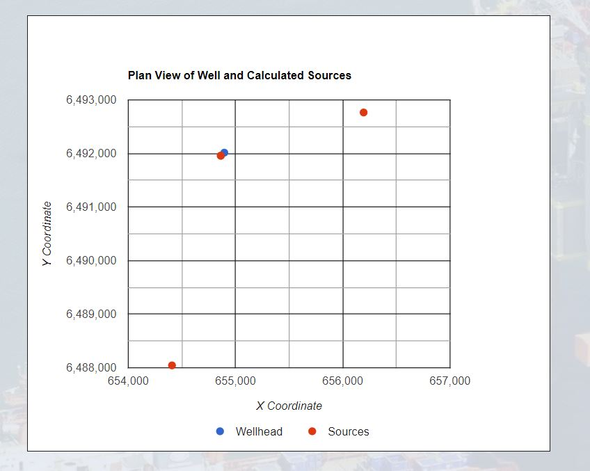

# VSP Source Locator

This website calculates the location of a single or series of VSP sources in relation to the wellhead. A VSP (Vertical Seismic Profile) survey is a type of seismic survey used by the oil industry. It is recorded by placing a series of receivers in an oil well and then setting off a sound source at a certain distance away from the well. The receivers record the sound waves and these data are then processed to generate a picture of the subsurface. It is essential to know the location of the source in relation to the well in order to process the VSP data. However the source location information is not always provided in the same format. Sometimes it is provided as X and Y UTM coordinates, other times as X and Y offsets from wellhead (the surface location of the well) or alternatively as an offset and azimth from wellhead. There is often a requirement for the data processor or field engineer (who records the survey) to convert the source location information from one format to another. It is not uncommon for mistakes in the conversion to be made particularly in the reports generated when the data are recorded as there tend to be certain time constraints. This site removes the human error by converting the source location from one format to another. It is targeted towards oil industry professionals involved in the planning, recording and processing of VSP data. It will be useful for quickly calculating source locations or as a check for reported locations.

[The live project can be found here.](https://stephanie-ash.github.io/vsp-source-locator/)

## User Stories

  1. As someone planning a multi source VSP survey I want to calculate the planned source locations in various formats ready to provide to the field engineer. I want to make a visual check of the planned locations to see if they are where I expect in relation to the wellhead.
  2. As a field engineer I want to convert the source UTM coordinates recorded with in the field into more useful offset and azimuth values for the report I am generating. I want to check that the resulting locations are where I expect.
  3. As a VSP data processor I want to convert the source location information provided with the recorded data into the format required by my processing software.

## Features

### Existing Features

* **Logo, Background Image and Title**
    * The logo of a simple rig with crane source alerts the user that the site is related to the oil industry and perhaps also VSP.
    * The background image of an oil rig is also instantly recognisable to oil industry professionals, even when cropped, and alerts them straight away that the site is designed for them.
    * The site title describes the purpose of the site and again alerts the user to the fact it is for VSP based professionals.

* **Instruction Area**
    * The instruction area explains to the user in more detail the purpose of the site.
    * It also allows the user to understand how the locator should be used.

* **Input Area**
    * The input area provides the user with boxes to input all the parameters needed to run the calculations.
    * The area is simply laid out with different types to inputs grouped together so that they are easily differentiated between. 
    * Alerts have been coded into the JavaScript file that alert the user to missing or incorrect inputs thus providing extra guidance on how to use the site.
    * The calculate button has been given a dark background to provide contrast with the calculator area background and catch the users eye.

* **Result Area**
    * The result area displays above the input area when the calculation is run, generally ensuring that the user does not have to scroll to find the results.
    * It provides the source location in both formats (both input values and calculated results) ensuring that the user has all the information they need.
    * The Create Plan button displays just below the results ensuring it is quick and easy to generate a plan to check the results.
    * The source location input boxes are cleared after the calculation is run making it easy for the user to input further values. 

* **Add Source Button and Source List**
    * The add source button allows the user to calculate a list of sources related to the same well. This is useful to the user as it is common to record a series of VSP surveys at the same well with the source increasing in offset.
    * The Input Wellhead Location boxes remain populated after the initial calculation so that the user does not have to input this information everytime they add an additional source. These values select on focus to save the user time if new locations are required.
    * An alert message will pop up if the user attempts to use the Add Source option after changing the Wellhead coordinates.

* **Plan Area**
    * The Create Plan button generates a Google Charts scatter chart which acts as a plan view of the wellhead and source locations.
    * This allows the user to make a quick visual check of the source locations to ensure that they are (for example) displaying on the expected side of the well.
    * The locations of the points are displayed on mouse hover making it easy to compare the source locations on the plan with those listed.

### Features Left to Implement

* **Tooltips**
    * Tooltips on mouse hover over the input boxes or buttons could provide further assistance to the user when using the site.
* **More Interactive Plan View**
    * A more interactive plan view would give the user the option to select the display parameters and set the maximum and minimum scale values to whatever they choose.

### Wireframes

* Desktop view wireframe [View](assets/wireframes/vsp-source-locator_desktop.jpg)

* Mobile view wireframe [View](assets/wireframes/vsp-source-locator_mobile.jpg)

## Testing

### Tested User Stories

  1. As someone planning a multi source VSP survey I want to calculate the planned source locations in various formats ready to provide to the field engineer. I want to make a visual check of the planned locations to see if they are where I expect in relation to the wellhead.
      * Upon entering the site the instruction area details the different source inputs that can be added and describes the add source option that can generate a list of more than one location.
      * The source list provides the user the option to calculate the location of all their planned sources.
      * The create plan option provides the user a quick visual check so that they can be certain the sources are where they are expecting.
  2. As a field engineer I want to convert the source UTM coordinates recorded with in the field into more useful offset and azimuth values for the report I am generating. I want to check that the resulting locations are where I expect.
      * The site offers a quick way to convert from source UTMs to offsets and azimuths.
      * The site allows the user to be confident that the information they add to their report is correct.
      * The create plan option again provides a visual check which the user can compare to their map of the well area.
  3. As a VSP data processor I want to convert the source location information provided with the recorded data into the format required by my processing software.
      * The UTM and offset and azimuth source location inputs allow the user calculate the values required however the information is provided in the field report.
      * The instruction area details an additional way of using the site if the source locations are provided as X and Y offsets from wellhead.

### Validator Testing

* HTML
    * No errors have been found when passing through the [W3C validator](https://validator.w3.org/).
* CSS
    * No errors have been found when passing through the [Jigsaw validator](https://jigsaw.w3.org/css-validator/).
* JS
    * [JSHint](https://jshint.com/) was used to validate the JS. Missing semicolons were identified and added to the code. No other major issues have been identified.

### Further Testing

* Continuous testing was carried out throughout the development process with display or functionality errors corrected as they appeared. The functionality was also tested throughout.
* The initial checks in the checkValues function to ensure input values had been provided had not taken into account the fact that zero values would be considered falsy and further conditions were added.
* A check to see if the input source and wellhead locations were identical was originally added to the calculation functions. However, although the warning alert worked correctly, the calculations were still carried out and undefined values were displayed. This check was moved to the checkValues function.
* The event listener for the Add Source button was initially activated after the first calculation was carried out. However this resulted in the event listener running twice if both the Calculate and Add Source options were run again leading to an alert notifying of missing input values. It was decided that all event listeneres should instead be added when the DOM content loaded and a variable created to define which button had been clicked.
* It is not possible to test every possible input value as the range of acceptable values is so wide (including 6-7 figure UTM coordinates or 2 figure offsets). A variety of input values have been tested spanning all quadrants of the circle. These checks have included values that you would not normally expect from a VSP survey and values from real VSP jobs. Checks and solutions have been added for North, South, East or West locations which may result in division by zero.
* A fellow VSP processor was asked to test values from various VSP jobs they had processed.
*  It is possible that the calculation will not work correctly for certain values but these should generally be values that would not be seen in a VSP survey.
* The site was tested on various screen sizes using the Chrome Developer tools and media queries added.
    * The largest likely calculated values have been considered when setting these display parameters.
* Friends and family members were asked to review the site on various mobile devices to determine if the site was suitably responsive.

### Validator Testing

* HTML
    * When pasing the individual routes pages through the [W3C validator](https://validator.w3.org/) issues were identified with the iframe maps. These have been solved by moving some of the iframe styling including the percentage width and scrolling to the CSS stylesheet.
    * No errors are now returned for all pages.
* CSS
    * No errors have been found when passing through the [Jigsaw validator](https://jigsaw.w3.org/css-validator/)

### Unfixed Bugs

* HTML and CSS do not allow for the creation of a database to receive form information. The club page currently submits the form information to the code institue form dump.

